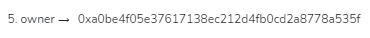
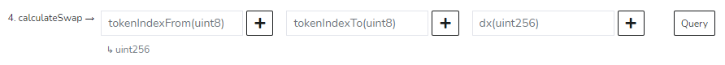
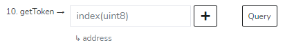
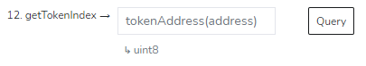
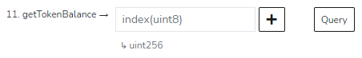
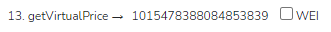

# StableVault Pool

The StableVault deposit contract is included in our registry over at the GaugeProxyV2 [**contract**](https://snowtrace.io/address/0x215D5eDEb6A6a3f84AE9d72962FEaCCdF815BF27), together with all other compounding deposit contracts.


If you are looking to query wallet balances off the StableVault pool, info from the [**Compounding Pools**](compounding-pools.md) integration page is still relevant. Ratios and underlying tokens are non-applicable, however.


### s4D Token Contract

**Contract Address:** [0xB91124eCEF333f17354ADD2A8b944C76979fE3EC](https://snowtrace.io/address/0xB91124eCEF333f17354ADD2A8b944C76979fE3EC)

The s4D swap contract can be found through the **owner** method (#5).

### s4D Swap Contract

**Contract Address:** [0xA0bE4f05E37617138Ec212D4fB0cD2A8778a535F](https://snowtrace.io/address/0xA0bE4f05E37617138Ec212D4fB0cD2A8778a535F)

To estimate the output of a swap, use the **calculateSwap** method (#4).

The address of each of the tokens in the pool can be found through the **getToken** method (#10).

The same can be done in reverse with the **getTokenIndex** method (#12), in case you have the addresses of the underlying tokens but not their indexes.

To see the balance of each token in the pool, use the **getTokenBalance** method (#11).

To calculate the price of the s4D token, you will need to use the **getVirtualPrice** method (#13).

With this virtual price, you can find the price of the s4D token like so, assuming each of the stablecoins maintains its peg at $1:

$$
\text{Estimated s4D Price} = \frac{\text{Virtual Price}} {10^{\text{Decimals}}}
$$

To calculate an exact price, you would have to multiply each of the 4 token's prices by their balances in the pool and divide by the total supply of the s4D token. In the following equation, P refers to price, and B refers to balance in the pool.

$$
\text{Tokens' Value} = \frac{\sum{\text{(P(Token) ∗ B(Token))}}} {\text{s4D Total Supply}}
$$

$$
\text{s4D Price} = \frac{\text{Virtual Price ∗ Tokens' Value}} {10^{\text{Decimals}}}
$$
