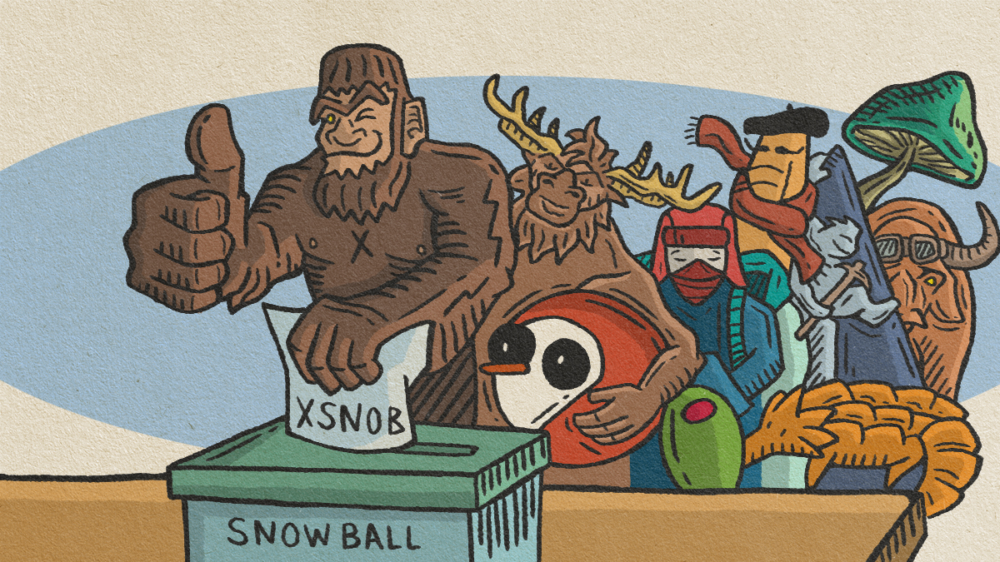

# Community Proposals

Snowball is democratically governed by the community through its governance protocol. To vote, you must lock SNOB tokens for xSNOB. One xSNOB is equal to one vote, but fractional votes are allowed.

## **Proposals**

Anyone with xSNOB tokens can vote on Snowball proposals. For a proposal to pass, there are a few conditions that must be met:

* There must be a minimum of 300,000 votes in favor of the proposal.
* There must be more votes in favor than those against the proposal.

Your vote can be changed after voting in case you've changed your mind.

In order to create a proposal, you must hold a minimum of 100,000 xSNOB. If you do not have the required minimum number of tokens, someone who does can execute the proposal on your behalf. You may only have one active proposal at any given time.

## **Timelocks**

Every proposal must have a voting period of at least 72 hours. Once the voting period comes to an end, there is an execution delay of 24 hours prior to any technical changes to the Snowball protocol.

Every proposal also has an execution window of 14 days (2 weeks), after which the proposal is considered void.

## Governance Resources


[xsnob](xsnob/)



[xsnob-faq.md](../resources/frequently-asked-questions/xsnob-faq.md)



[snowball-contracts.md](../resources/smart-contracts/snowball-contracts.md)

