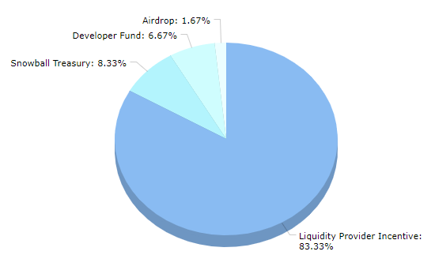

# SNOB

The SNOB token is Snowball’s governance token. It can be locked for xSNOB to vote on proposals, vote on weekly SNOB allocations, earn a portion of protocol revenue, and earn boosted SNOB rewards.

**Ticker:** SNOB

**Max Supply:** 18,000,000

**Token Address:** [**0xC38f41A296A4493Ff429F1238e030924A1542e50**](https://snowtrace.io/token/0xC38f41A296A4493Ff429F1238e030924A1542e50)

**Chain:** Avalanche C-Chain

## **Token Distribution**

## **Emission Schedule**

There is a total max supply of 18 million SNOB tokens. These tokens are currently being emitted through a schedule decided upon by governance proposal 12, which is the following:



| Block      | SNOB /block |
| ---------- | ----------- |
| 3,065,000  | 0.5         |
| 3,515,000  | 0.47        |
| 3,965,000  | 0.44        |
| 4,415,000  | 0.41        |
| 4,865,000  | 0.38        |
| 5,315,000  | 0.35        |
| 5,765,000  | 0.32        |
| 6,215,000  | 0.29        |
| 6,665,000  | 0.26        |
| 7,115,000  | 0.23        |
| 7,565,000  | 0.2         |
| 8,015,000  | 0.17        |
| 8,465,000  | 0.14        |
| 8,915,000  | 0.11        |
| 9,365,000  | 0.08        |
| 9,815,000  | 0.05        |
| 10,265,000 | 0.02        |
| 10,715,000 | 0           |







## **How to earn SNOB**

SNOB is earned by using Snowball’s products. When you deposit into a product on Snowball, you receive a receipt token that can be deposited again to earn SNOB.

The amount of SNOB you get for depositing in each product varies weekly and is determined by Snowball’s gauges. View this week’s SNOB distribution on the [**xSNOB**](https://app.snowball.network/staking) page of our website, or a history of distributions [**here**](xsnob/revenue-sharing.md#historical-distributions).

SNOB can also be purchased on exchanges. [**Pangolin**](https://info.pangolin.exchange/#/token/0xc38f41a296a4493ff429f1238e030924a1542e50) and [**Trader Joe**](https://analytics.traderjoexyz.com/tokens/0xc38f41a296a4493ff429f1238e030924a1542e50) both support the SNOB token.

## **SNOB Resources**


[general-faq.md](../faq/general-faq.md)



[xsnob](xsnob/)



[snowball-contracts.md](../smart-contracts/snowball-contracts.md)

