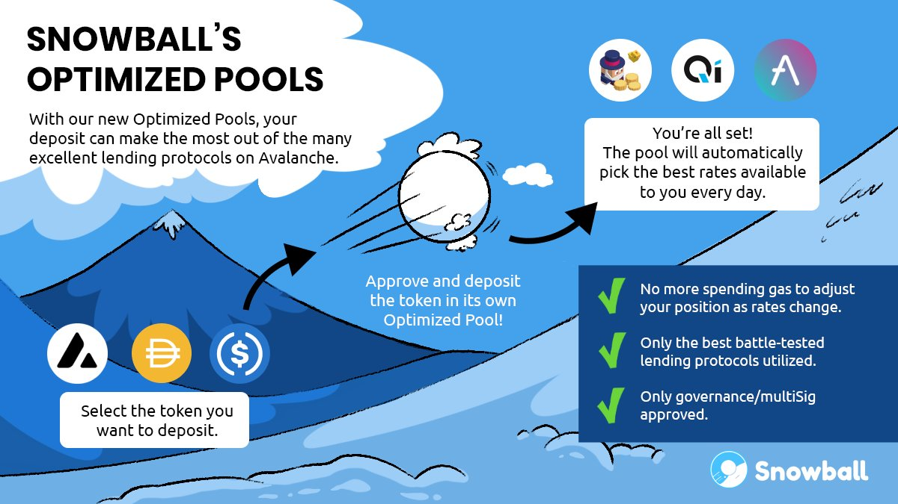

# Compounding

Snowball's compounding product allow you to automatically compound the rewards you receive from other DeFi projects. Essentially, you earn more rewards than you would otherwise because you’re constantly reinvesting your rewards.


Looking for a quick answer to a simple question? Check out our [**Compounding FAQ**](../faq/compounding-faq.md).


## Why compound with Snowball?

After all, isn't this something you could do manually? The benefits of [_**compounding**_](../resources/defi-glossary.md#compounding) with Snowball are the following:

* **Gas Fees** - Each transaction costs [_**gas**_](../resources/defi-glossary.md#gas) fees. These fees add up over time, and can sometimes even outweigh the benefits of compounding. Snowball pays those gas fees for you.
* **Time** - Compounding is time-consuming. To get the most out of compounding, you generally need to compound rewards multiple times a day. Snowball automates the compounding process for you and saves you a lot of time you could be using elsewhere.
* **Extra Rewards** - By compounding with Snowball you also gain additional SNOB token rewards. This means that your total returns would be even higher than if you would compound manually yourself.

## What DeFi projects are supported?

Snowball supports many [_**DEXs**_](../resources/defi-glossary.md#decentralized-exchange-dex), lending platforms and other types of decentralized apps:

* [**Pangolin**](https://app.pangolin.exchange)
* [**Trader Joe**](https://traderjoexyz.com)
* [**Banker Joe**](https://traderjoexyz.com/#/lending)
* [**BenQi**](https://app.benqi.fi)
* [**Aave**](https://app.aave.com)
* [**Teddy**](https://app.teddy.cash)
* [**Axial**](https://app.axial.exchange)
* [**Platypus**](https://platypus.finance)

All our compounding strategies can be found in the [**Compound & Earn**](https://app.snowball.network/compound-and-earn) page of our site.


Snowball now has Optimized Pools, which can be used to aggregate various platforms, and gain the yield of whichever one has the best rates at any given time. Learn more about there [**here**](https://medium.com/snowball-finance/introducing-snowballs-optimized-pools-ebba8dca34d9).


## How does compounding work?

The basics of auto-compounding involve reinvesting rewards accrued from other DeFi projects, but the process of doing so involves a few more steps. The functionality of Snowball's compounding strategies also vary based on whether it is a liquidity pool, lending or staking strategy:

### Liquidity Pool Strategies

Liquidity pool (LP) strategies are the most common type of strategy you'll find at Snowball. These involve depositing two or more assets into a [_**liquidity pool**_](../resources/defi-glossary.md#liquidity-pool) of a supported DeFi project, and depositing the resulting LP token into Snowball's compounding strategy. Snowball then deposits your LP token back into the other project and auto-compounds any rewards you receive over time.

These strategies have some of the highest APYs available on Snowball. This is because not only are they heavily incentivized by DEXs that need liquidity, but you also gain value from trading fees as other Avalanche users use the liquidity you provide to trade between tokens.


To learn more about liquidity pools, check out the [**YF 122 - Liquidity Pools**](../defi-university/1st-year-courses/yf-122-liquidity-pools.md) course over at our DeFi University!


### Lending + Folding Strategies

Lending strategies are some of the safest investment strategies you can find, and involve lending a token of your choice on Snowball, which then deposits your token on a lending platform such as Banker Joe, BenQi or Aave. Other than the usual automatic reinvesting of rewards however, Snowball also implements [_**folding**_](../resources/defi-glossary.md#folding) - a strategy to dramatically increase returns with no extra risk if certain market conditions are met.

Folding strategies involve borrowing and lending the same token multiple times in order to multiply the incentive rewards received by the underlying DeFi project. If market conditions no longer make this strategy profitable, Snowball's strategies automatically unfold your investments to avoid any losses.


Looking for a more in-depth explanation of folding strategies? Check out the [**YF 312 - Folding**](../defi-university/3rd-year-courses/yf-312-folding.md) course over at our DeFi University.


### Staking Strategies

Staking strategies are simple, yet very effective. Examples of these are PNG staking through Pangolin, xJOE staking through Trader Joe, or TEDDY staking through Teddy. Depositing these tokens through Snowball instead of directly through their respective platforms will have all the benefits of auto-compounding, and therefore get you more returns with even less effort required on your part.

## One-Click Deposits

Many of our compounding strategies allow you to deposit funds in a much simpler manner through a single token. This is sometimes referred to as zapping. For a quick overview of this process, check out our infographic below - or for a more in-depth review, read our article [**here**](https://medium.com/snowball-finance/a-look-at-snowballs-new-zapper-functionality-a7ddabae483).

## Optimized Pools

Snowball also offers Optimized Pools, which enable you to always be netting the highest yields available for the token you wish to deposit. Check out our infographic about them below, or read a more in-depth article about them [**here**](https://medium.com/snowball-finance/introducing-snowballs-optimized-pools-ebba8dca34d9).

## Compounding Resources


[compounding-faq.md](../faq/compounding-faq.md)



[compounding-contracts.md](../smart-contracts/compounding-contracts.md)



[harvest-stats.md](../resources/harvest-stats.md)



[compounding-guide-trader-joe.md](../resources/guides/compounding-guide-trader-joe.md)



[compounding-guide-pangolin.md](../resources/guides/compounding-guide-pangolin.md)

