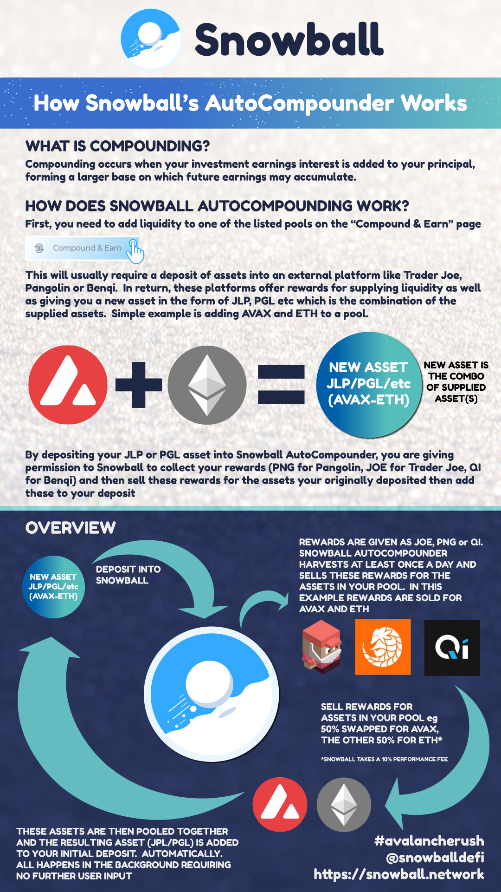

# Compounding

Snowball's compound feature allows you to auto-compound the rewards you receive from other DeFi projects. Essentially, you earn more rewards than you would otherwise because you’re constantly reinvesting your rewards. 

## What is compounding?

In order to take advantage of [_**compounding**_](https://snowballs.gitbook.io/snowball-docs/resources/defi-glossary#compounding), you need to first deposit into a reward farm. A reward farm is any place where you deposit funds and receive rewards in return. The most common reward farms are on [_**Decentralized Exchanges (DEXs)**_](https://snowballs.gitbook.io/snowball-docs/resources/defi-glossary#decentralized-exchange-dex), and are called liquidity pools.

Compounding is when the rewards you get from depositing are reinvested to earn more rewards over time. This causes exponential growth because the original deposit AND the reinvested assets earn rewards. 

## How does it work?

Compounding works by automatically selling your rewards from other protocols for the tokens you originally deposited, and re-investing those funds; exponentially increasing your gains over time. A more detailed explanation of the entire process can be seen in the image below:

For single-asset farms (Example: BenQi farms), sometimes Snowball can perform a [_**folding**_](https://snowballs.gitbook.io/snowball-docs/resources/defi-glossary#folding) strategy, where an asset is lent and borrowed multiple times in order to increase profits.

## The benefits of compounding with Snowball

While compounding is something that you can easily do on your own, there are a couple reasons why it’s better to use Snowball. 

First, compounding costs [_**gas**_](https://snowballs.gitbook.io/snowball-docs/resources/defi-glossary#gas) fees. These fees add up and can often outweigh the benefits of compounding. With Snowball, you pay zero gas fees. Snowball pays the fees for you.

Second, compounding is time consuming. To get the most out of compounding you generally need to compound rewards multiple times per day. Snowball automates the compounding process so that you don’t need to remember to compound or waste your valuable time. 

Third, by depositing into Snowball’s compounding strategies, you earn additional SNOB token rewards. This means that you earn higher rewards than you would compounding by yourself. 

## Supported Reward Farms

Snowball supports deposits from reward farms on Pangolin and Trader Joe, along with lending pools from BenQi, Aave and Trader Joe. This means that when you supply [_**liquidity**_](https://snowballs.gitbook.io/snowball-docs/resources/defi-glossary#liquidity) or lend your tokens to any of these platforms, you can also deposit into Snowball to compound your earnings.

To view the full list of supported compounding pools, visit the [**Compound**](https://app.snowball.network/compound-and-earn) page of our website.

## Compounding Resources


[compounding-faq.md](../resources/frequently-asked-questions/compounding-faq.md)



[compounding-guide-trader-joe.md](../resources/guides/compounding-guide-trader-joe.md)



[compounding-guide-pangolin.md](../resources/guides/compounding-guide-pangolin.md)



[compounding-contracts](../resources/smart-contracts/compounding-contracts/)



[harvest-stats.md](../resources/harvest-stats.md)

