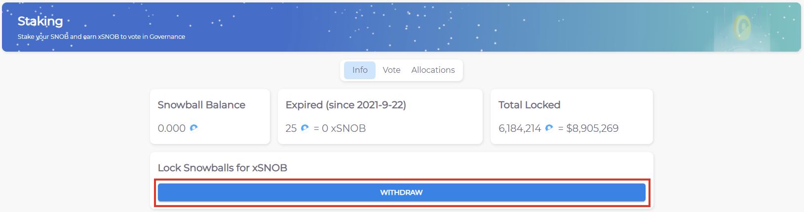

# Unstaking SNOB

This guide covers how to unstake your SNOB tokens. Keep in mind you cannot unstake before the lock period you selected has expired. To learn more about how SNOB staking works, check out our docs [**here**](../../governance/xsnob/) or our FAQ [**here**](../../faq/xsnob-faq.md).

1\) Head to the staking page of our website [**here**](https://app.snowball.network/staking). Make sure you connect your wallet and that you are currently on the Avalanche Chain.

2\) As long as your stake has expired, you will be able to click **WITHDRAW**. You will be asked to approve the transaction through your wallet.

**Congratulations!** As soon as the transaction is confirmed, your SNOB should be back in your wallet. Thank you for contributing to Snowball's governance during your stake, and we hope you'll return soon!
