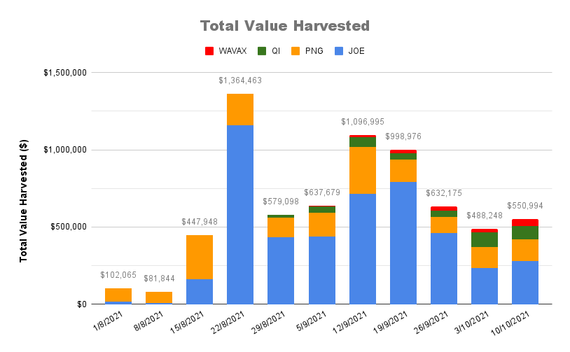
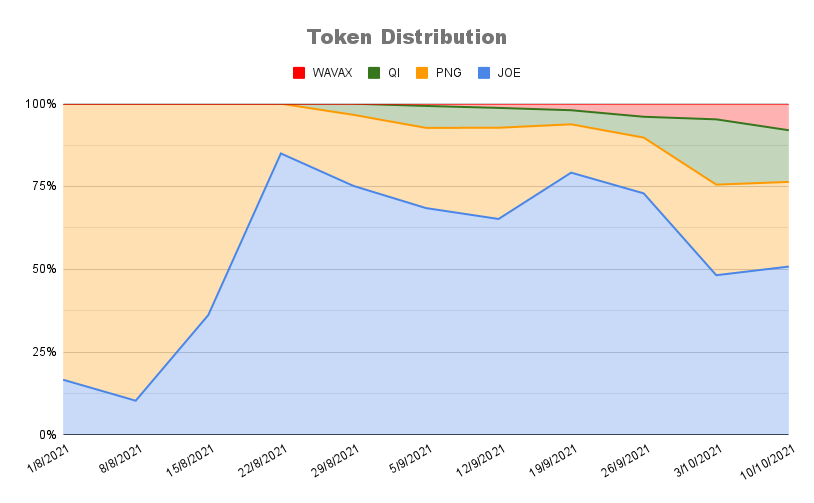
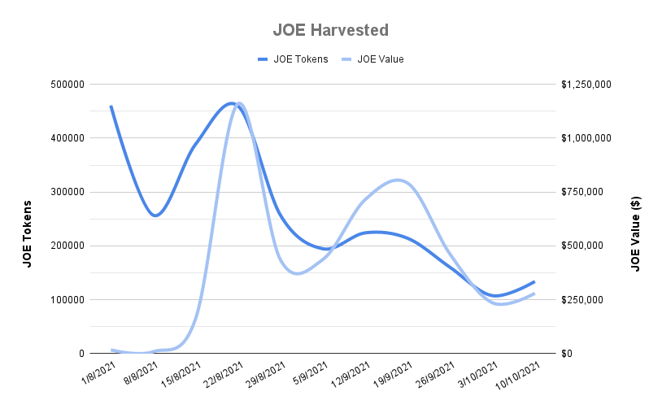
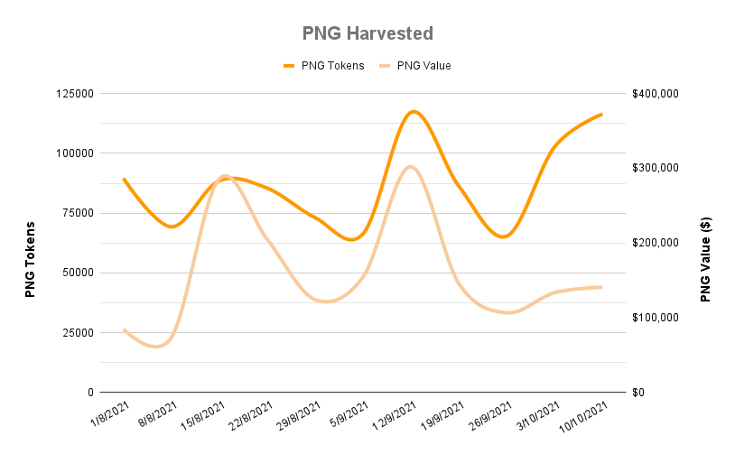
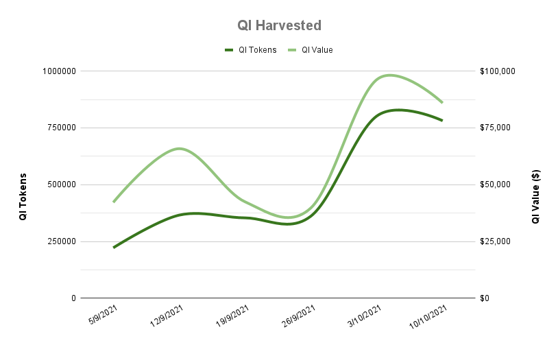
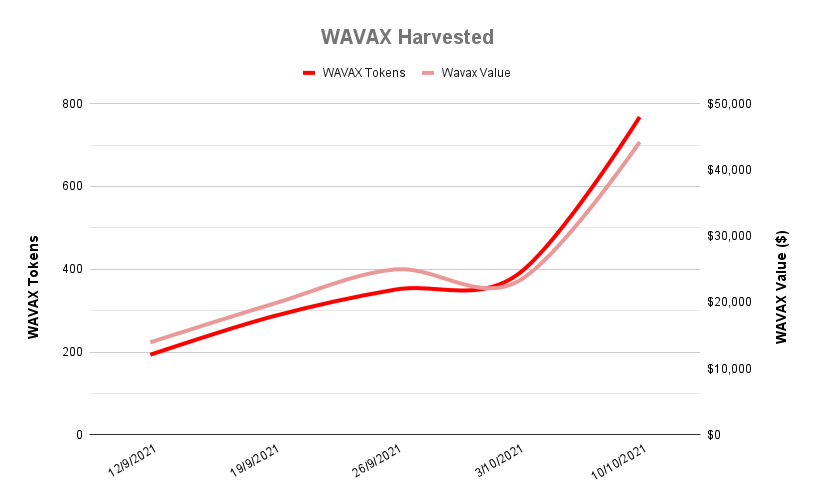

# Harvest Stats

Every week we take a snapshot of how our auto-compounding strategies have performed. The results of which are presented here!


Weekly snapshots are taken every Sunday, and this page is updated every Monday.


## Overall Harvest Stats











## Individual Token Stats


















