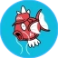

# Our Team

####  Big Wampa   

####  8-Bit Giraffe  

####  Abominable Sasquatch 

####  Bloomie  

####  Bmino  

####  Leo  

####  Jomari  

####  Jonas  

####  Timbotronic  

####  Tide  

####  Abbie  

####  Auroter 

####  Saito  

####  Jennywenny  

####  Frostbourne  

####  Sanjeev1308  

####  Tian  

####  David-Defi-Web  

####  Feds  

####  GuanabaNat  

####  Luis  

####  Cryptogoddess91  

####  Pan\_  

####  Ncookie  

####  AzuLeto  

####  Sergio2098  

####  Mo Gibbs  

####  Shung  

####  Warcha  

####  Erkan  

####  Mintle  

####  Nrv  

####  Kadir  

####  TylerS  

####  Jahn_k  

####  Louis Lee  

####  Metadept  

####  Whale Club  

####  Cryptofish  


Want to be a part of our team or contribute to the development of Snowball? Reach out to us on [**Discord**](https://discord.gg/BPnBYDSqcb).

