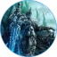
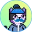

# Our Team

Our team is made up of a large assortment of talented individuals from the community, who have contributed to making Snowball the platform it is today.


Want to be a part of our team and contribute to the development of Snowball? Reach out to us on [**Discord**](https://discord.gg/BPnBYDSqcb).


## Core Team

####  Big Wampa (Founder) | [**Twitter**](https://twitter.com/big\_wampa)

####  8-Bit Giraffe (Founder) | [**Twitter**](https://twitter.com/8bitgiraffe\_)

8-Bit Giraffe is one of the three co-founders of Snowball; an American giraffe with a bachelors degree in marketing, with a minor in psychology. As a full believer in the space, they've quit their legacy job to create Snowball with the other co-founders, contributing their business and marketing know-how in order to make it a reality.

####  Abominable Sasquatch (Founder) | [**Twitter**](https://twitter.com/abominablesas)

Abominable Sasquatch is enjoying the Avalanche.

####  Jomari (**Core Strategist**) | [**Twitter**](https://twitter.com/Jomari\_P)

####  Jonas (Software Engineer) | [**Twitter**](https://twitter.com/cyberjenos)

Jonas is a Brazilian software engineer with over 7 years of experience working with ERP systems and other web 2.0 technologies. Having coded Pangolin's 'Pangobot' for fun, they quickly become involved with the Avalanche ecosystem, and now contributed much to the back-end and front-end development of Snowball. They are also a member of Snowball's council.

####  Saito (Software Engineer)

Saito hails from El Salvador, and has over 9 years of experience in software engineering and software architecture. They've helped develop much of the back-end, dev-ops and infrastructure behind Snowball's products.

####  Abbie (Smart Contract Engineer)

Auroter hails from the US, and has a background as a value engineer, systems engineer and mathematician. At Snowball, they've worked on developing smart contracts; the foundation of Snowball's products.

####  Sanjeev1308 (Front-End Engineer)

####  David-Defi-Web (Front-End Engineer)

####  Mohsen (Front-End Engineer)

####  GuanabaNat (Illustrator)

####  Dilaanys (Illustrator)

####  Cryptogoddess91 (Marketing Coordinator) | [Twitter](https://twitter.com/cryptogoddess91)

Cryptogoddess91 is from the US, and has three associate degrees in business administration, social and behavioral sciences and natural sciences, as well as a nanodegree in UX design. When they aren't dancing, laughing or exploring the world they are using their creative skills to create amazing UX designs for Snowball's community.

####  Ncookie (Technical Writer) | [**Twitter**](https://twitter.com/ncookie\_eth)

Ncookie is a Brazilian software engineer with a bachelors degree in computer science. While developing 'CookieTrack', they've become increasingly excited about the future of DeFi and the Avalanche ecosystem, and now generates the internal and external documentation as well as writing articles and newsletters for the Snowball community.

## Support Team

####  AzuLeto (Discord Community Moderator)

####  Sergio2098 (Telegram Community Moderator) | [Telegram](https://t.me/sergio\_2098)

Sergio2098, from Turkey, has stepped up to provide moderation and support to the Snowball community over at our Telegram group, and has allowed the huge number of Turkish DeFi users to use Snowball through translations of our documentation and guides.

####  Zacknistelrooy (Business Development & Support Staff)

####  Erkan (Support Staff)

## Active Community Contributors

####  Auroter

####  Frostbourne

####  Feds

####  Luis

####  Pan\_

####  Bloomie

####  Bmino

####  Leo

####  Nrv

####  TylerS

####  NaotaMax

####  The Baked One

## Past Community Contributors

####  Mintle

####  Kadir

####  Jahn\_k

####  Louis Lee

####  Metadept

####  Whale Club

####  Cryptofish

#### **** **Elroy**

#### **** **Jediballs**

#### **** **Pedrohccq**

####  Shung

####  Timbotronic

####  Tide

####  Jennywenny
