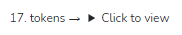
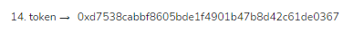
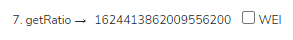
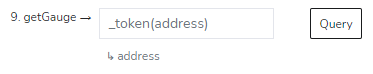
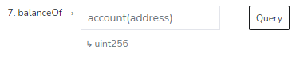
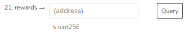

# Compounding Pools

The data regarding the many compounding pools on Snowball can be reached through the GaugeProxyV2 contract as a starting point.

**GaugeProxyV2 Contract:** [**0x215D5eDEb6A6a3f84AE9d72962FEaCCdF815BF27**](https://snowtrace.io/address/0x215D5eDEb6A6a3f84AE9d72962FEaCCdF815BF27)****


If you're looking instead for a simple list of all our compounding contracts, see our [**Compounding Contracts**](../compounding-contracts.md) page.



If you're looking for how to write to our compounding contracts through a block explorer, see our [**Manual Smart-Contract Interaction**](../../resources/guides/manual-contract-interaction.md) guide.


### SnowGlobe Contracts

Through GaugeProxyV2, you can find all SnowGlobe contracts with the **tokens** method (#17).

The underlying token deposited by a user can be found with the **token** method (#14).

The token ratio between the underlying token and the SnowGlobe contract can be found through the **getRatio** method (#7).

This ratio is can be used to get a user's true balance in the underlying token:

$$
\text{Underlying Balance} = \frac{\text{Ratio ∗ User Balance}} {10^{\text{Decimals}}}
$$

Keep in mind that querying for user balances should be done through the gauge contract, not the SnowGlobe contract.

### Gauge Contracts

Through GaugeProxyV2, you can find all gauge contracts with the **getGauge** method (#9). The variable inputted can be any of the SnowGlobe contracts found previously.

Balances can be found with the **balanceOf** method (#7). This will return the balance of the SnowGlobe contract for a specific wallet. Use the ratio found from the Snowglobe contract to calculate the actual underlying token balance for that wallet.

To find the SNOB token rewards that have have accumulated over time for a specific wallet, use the **rewards** method (#21).

